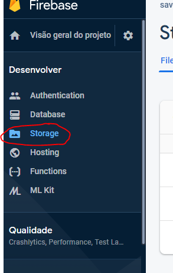
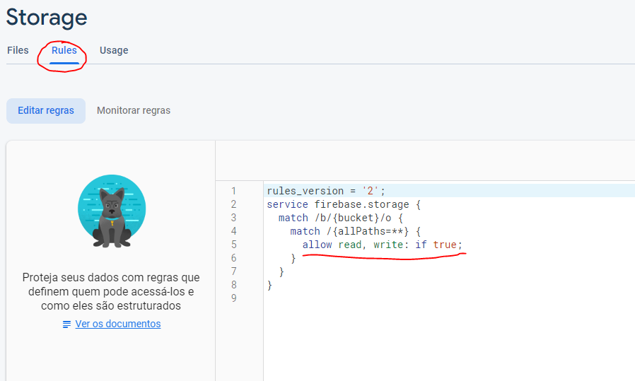
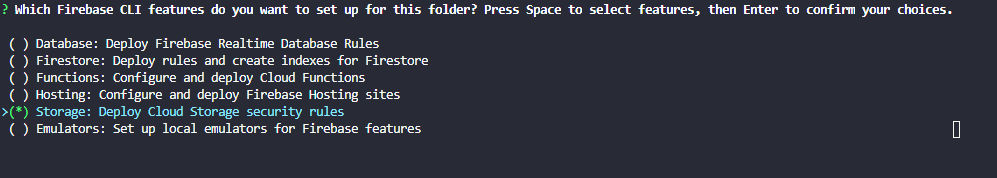

# Salvando imagens no firebase com React

Esse projeto é um exemplo simples de como realizar um cadastro de imagens no firebase, e carregar essas imagens salvas no seu projeto.

## Configurando o projeto no console do firebase

Antes de se iniciar o projeto **React**, você deve configurar o firebase. Para isso, acesse o [console do firebase](https://console.firebase.google.com/) e crie um novo projeto. (Não há a necessidade de configurar o **Analytics**).

Ao criar o projeto, você deve configurar o **Storage**, para isso, selecione o item de menu como na imagem abaixo.

Realize as configurações básicas do storage conforme suas preferências.

Agora você deve configurar as regras do seu bucket para permitir que você realize os envios de arquivos para o firebase. Selecione a opção **Rules** e edite as regras conforme sua preferência.

Caso você não saiba como configurar as regras, siga o exemplo abaixo.

**IMPORTANTE:** E exemplo abaixo premite que QUALQUER um que tenha acesso ao seu bucket, terá permissões de leitura e escrita.

## Configurando o firebase no projeto React

Agora você já pode configurar o firebase dentro do seu projeto **React**, para isso, crie um novo projeto (Você pode utilizar a ferramenta **create-react-app** se quiser).

Instale a ferramenta de linha de comando do firebase globalmente:

`npm i -g firebase-tools`

Faça login pelo firebase CLI:

`firebase login`

Inicialize o firebase no seu projeto **React**:

`firebase init`

* Selecione o projeto que você criou pelo console do firebase

* Quando solicitado quais serviços do firebase você deseja utilizar, selecione **Storage** como na imagem a seguir:

Pronto! Projeto configurado.
